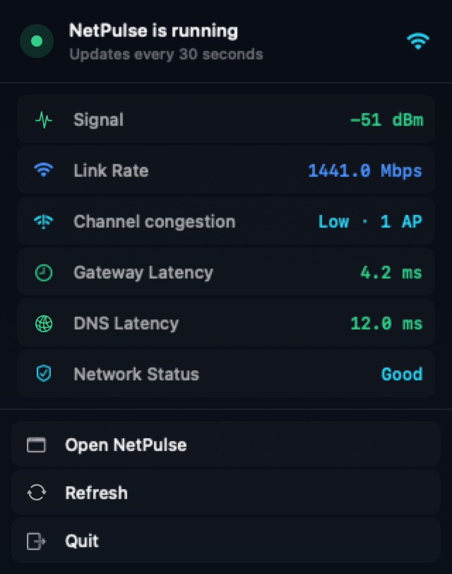

# NetPulse


NetPulse is a native macOS network diagnostics app for Apple Silicon. It brings Wi-Fi conditions, latency, DNS, live traffic, download throughput, and website timing into one place so that a slow connection is easier to explain.


## For Users

### Download and install

[Download NetPulse 1.0 Beta 4](https://github.com/JasonGuoo/NetPulse/releases/tag/v1.0.0-beta.4) from GitHub Releases.

1. Download `NetPulse-1.0.0-beta.4-macOS-arm64.zip`.
2. Extract the archive and move `NetPulse.app` to Applications.
3. On first launch, Control-click the app, choose **Open**, and confirm.

The beta is ad-hoc signed and is not notarized with Apple. The published app supports Apple Silicon only and requires macOS 14 Sonoma or later.

NetPulse does not require `sudo`, create an account, or install a background service.

### What NetPulse shows

| Area | Details |
| --- | --- |
| Overview | Health score, likely root cause, gateway, active DNS, proxy and VPN state, public egress, and Wi-Fi status |
| Connections | Per-process traffic, active remote endpoints, cumulative transfer totals, and local listening ports |
| Wi-Fi link | RSSI, noise, SNR, negotiated rate, channel width, MCS, PHY mode, nearby channel use, and latency history |
| Speed | Cloudflare download test alongside negotiated Wi-Fi rate and whole-system traffic |
| Diagnose | DNS, TCP, TLS, time to first byte, and download timing for a URL, plus system and public DNS comparison |
| Menu bar | Signal strength, link rate, current-channel congestion, gateway and DNS latency, and network status |

The menu bar panel takes a lightweight snapshot every 30 seconds and refreshes immediately when opened. It can be shown or hidden from the gear menu in the main window or from NetPulse Settings.



The interface can follow the system language or use English, Simplified Chinese, Japanese, or Korean.

### Network access and privacy

NetPulse has no accounts, analytics, advertising, or crash-reporting service. It saves the selected interface language, menu bar visibility, the last diagnosed URL, and up to five recent diagnostic URLs in the current user's macOS preferences. Measurement results remain in memory and are discarded when NetPulse quits.

The following features make network requests:

| Activity | When it runs | Destination |
| --- | --- | --- |
| Connectivity and latency checks | While NetPulse is running | The current gateway, active DNS server, `1.1.1.1`, and `8.8.8.8` |
| Public egress lookup | At launch and about every five minutes | Cloudflare trace and `ipinfo.io` |
| Download speed test | Only when requested | Cloudflare's speed test endpoint; normally about 8–28 MB including warm-up |
| Website diagnosis | Only when requested | The URL entered by the user, the system resolver, `1.1.1.1`, and `8.8.8.8` |

Process names, network addresses, SSIDs, and public IP details can be sensitive. Review and redact screenshots or logs before posting them. See [Privacy](docs/PRIVACY.md) for the full data-flow summary.

### Known limitations

- macOS privacy controls and OS changes can hide the SSID or nearby networks.
- An unprivileged process cannot always inspect connections owned by other users or `root`.
- Per-connection packet loss is not available without elevated capture privileges. NetPulse uses target pings and system-wide TCP retransmissions as supporting signals.
- Some routers and networks block ICMP. A failed ping alone does not prove that the Internet connection is down.
- Download tests use real bandwidth and may incur data charges.
- A health score compresses several measurements into one number. Check the underlying metrics before acting on it.

For general questions, read [Support](SUPPORT.md). Report reproducible bugs through [GitHub Issues](https://github.com/JasonGuoo/NetPulse/issues), and report security problems through the private process in [Security](SECURITY.md).

## For Developers

[](https://github.com/JasonGuoo/NetPulse/actions/workflows/ci.yml)

### Development requirements

- macOS 14 Sonoma or later
- Xcode Command Line Tools
- Swift 5.10 or later

The project is a native SwiftUI application with no third-party Swift package dependencies and no NetPulse backend.

### Build and test

```bash
git clone https://github.com/JasonGuoo/NetPulse.git
cd NetPulse
swift build --arch arm64
swift run NetPulse
```

Run the test suite with:

```bash
swift test --arch arm64
```

Create a double-clickable app bundle with:

```bash
./scripts/make-app.sh
open build/NetPulse.app
```

The script produces an arm64-only, ad-hoc signed bundle at `build/NetPulse.app`. Build output is excluded from version control.

Create the verified release zip and SHA-256 file with:

```bash
./scripts/package-release.sh
```

### Architecture and data sources

NetPulse uses macOS frameworks and command-line tools already present on the system. The main inputs are CoreWLAN, `system_profiler`, `lsof`, `nettop`, `route`, `scutil`, `ipconfig`, `ping`, `dig`, and `netstat`.

Collectors feed a shared application model. Rule-based diagnostics then compare signal quality, latency, loss, DNS timing, HTTP timing, and measured throughput. These results are troubleshooting clues, not a substitute for a packet capture or an ISP-side test.

Read [Architecture](docs/ARCHITECTURE.md) for the component map, data flow, refresh cadence, and release layout.

### Repository layout

```text
.
├── Package.swift
├── VERSION                 # Current release version
├── Sources/NetPulse/
│   ├── App.swift           # Application entry point and development utilities
│   ├── AppModel.swift      # Shared observable state
│   ├── Components/         # Reusable charts and visual components
│   ├── Core/               # Collection, diagnostics, and speed testing
│   ├── Resources/          # App icon source
│   └── Views/              # Main application views
├── Tests/NetPulseTests/    # Parser and diagnostic-rule tests
├── docs/                   # Architecture, privacy, and release notes
└── scripts/                # App bundle and release-archive packaging
```

### Contributing

Bug reports and pull requests are welcome. Read [Contributing](CONTRIBUTING.md) before sending a change. Participation is governed by the [Code of Conduct](CODE_OF_CONDUCT.md), project decisions are described in [Governance](GOVERNANCE.md), and release history is recorded in the [Changelog](CHANGELOG.md).

## License

The current source tree is released under the [MIT License](LICENSE). Copies and substantial portions of the software must retain the original copyright notice and the complete MIT permission notice, including:

`Copyright (c) 2026 Jason Guo`

Unless a file says otherwise, this license covers the source code, tests, documentation, and bundled artwork in the repository. Previously published releases remain governed by the license included with that release.
