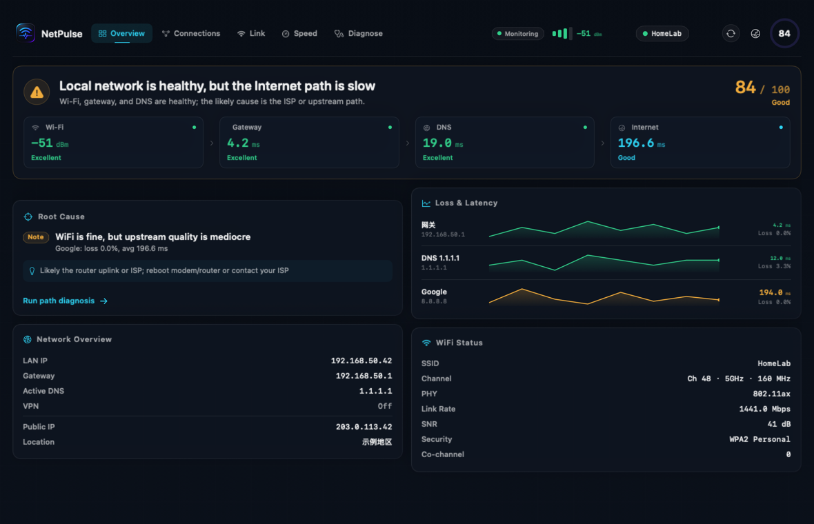

# NetPulse

NetPulse 是一款原生 macOS 网络诊断工具，用来查看 Wi-Fi 信号、当前连接、延迟、DNS 和下载速率，也能把一次网页访问拆成 DNS、TCP、TLS、首字节和下载几个阶段。

应用支持中文、英文、日语和韩语。



## 主要功能

| 页面 | 能看到什么 |
| --- | --- |
| 概况 | 网关、DNS、代理、VPN、公网出口、Wi-Fi 状态和当前健康结论 |
| 连接 | 按进程汇总的实时流量、远端地址、累计流量和本机监听端口 |
| 链路 | RSSI、噪声、SNR、协商速率、信道宽度、MCS、PHY、周边信道占用和延迟走势 |
| 速率 | Cloudflare 下载测速、Wi-Fi 协商速率和整机实时流量对照 |
| 诊断 | 指定网址的 DNS、TCP、TLS、首字节和下载耗时，以及 DNS 服务器对比 |

健康结论来自一组本地规则，主要用于区分 Wi-Fi 信号或干扰、外网质量、DNS、服务器响应和带宽问题。它适合排查方向，不代替抓包或运营商侧诊断。

## 运行要求

- macOS 14 Sonoma 或更高版本
- 从源码构建需要 Xcode Command Line Tools，以及 Swift 5.10 或更高版本
- 运行时不需要 `sudo`，也不安装后台服务

## 构建

```bash
swift build
swift run NetPulse
swift test
```

打包成可双击运行的 App：

```bash
./scripts/make-app.sh
open build/NetPulse.app
```

脚本会生成 ad-hoc 签名的 `build/NetPulse.app`。它没有经过 Apple 公证，因此发到另一台 Mac 后，首次启动可能需要在 Finder 中右键选择“打开”。构建目录不会提交到仓库。

## 数据来源与隐私

NetPulse 主要读取 macOS 自带接口和命令的输出，包括 CoreWLAN、`system_profiler`、`lsof`、`nettop`、`route`、`scutil`、`ipconfig`、`ping`、`dig` 和 `netstat`。项目没有第三方 Swift 依赖，也没有自己的服务端。

下面几类操作会产生外部网络请求：

- 公网出口信息：启动后及约每 5 分钟访问 Cloudflare trace 和 ipinfo.io
- 下载测速：手动触发后访问 Cloudflare，通常下载 8–28 MB；失败重试时可能更多
- 网页诊断：访问你输入的网址，并向系统 DNS 和公共 DNS 发起查询

最近诊断过的网址保存在本机的 UserDefaults。进程名、连接地址、SSID 和公网 IP 都可能涉及隐私；提交截图、日志或 Issue 前请先检查并打码。

## 已知限制

- macOS 的隐私策略和系统版本会影响 SSID、周边网络等字段，读不到时界面会留空或显示受限提示。
- 普通用户无法完整读取其他用户或 root 进程的连接信息。
- 单条连接的丢包无法在无特权模式下准确获取；界面使用目标 ping 和系统级 TCP 重传作为参考。
- ICMP 被路由器或网络屏蔽时，ping 结果不能单独说明网络已经断开。
- 下载测速会消耗实际流量，不建议在按流量计费的网络上频繁运行。

## 项目结构

```text
.
├── Package.swift
├── Sources/NetPulse/
│   ├── App.swift          # 应用入口和开发自检
│   ├── AppModel.swift     # UI 使用的全局状态
│   ├── Components/        # 图表和通用组件
│   ├── Core/              # 采集、测速和诊断逻辑
│   └── Views/             # 五个主页面
├── Tests/NetPulseTests/   # 解析器和诊断规则测试
└── scripts/make-app.sh    # 生成 .app
```

## 参与开发

Issue 和 Pull Request 都可以直接提。改解析器时请同时补一份脱敏后的测试样本；不要提交真实 SSID、公网 IP、设备名或账号信息。

提交前至少运行：

```bash
swift test
```

## License

项目使用 [MIT License](LICENSE)。可以修改、分发、商用或用于闭源项目，但需要保留许可证和版权声明。
